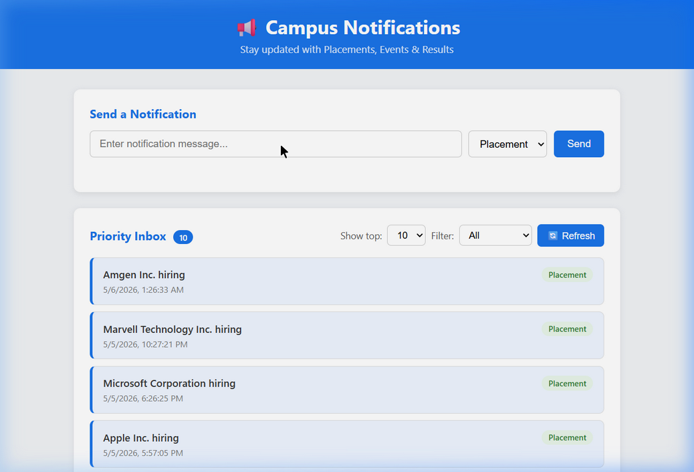
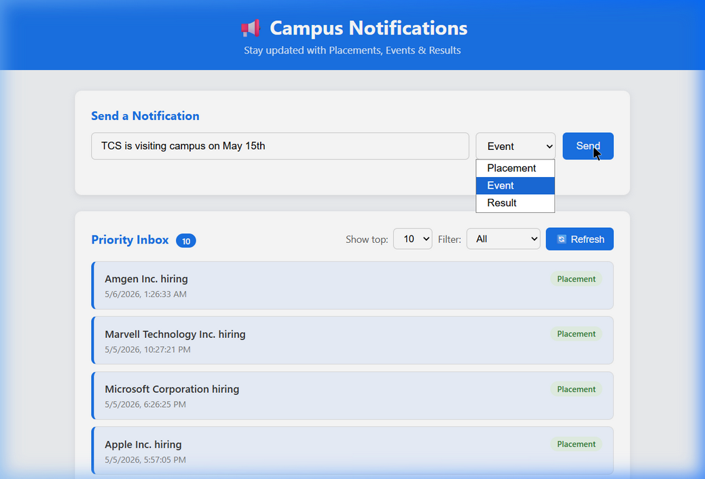
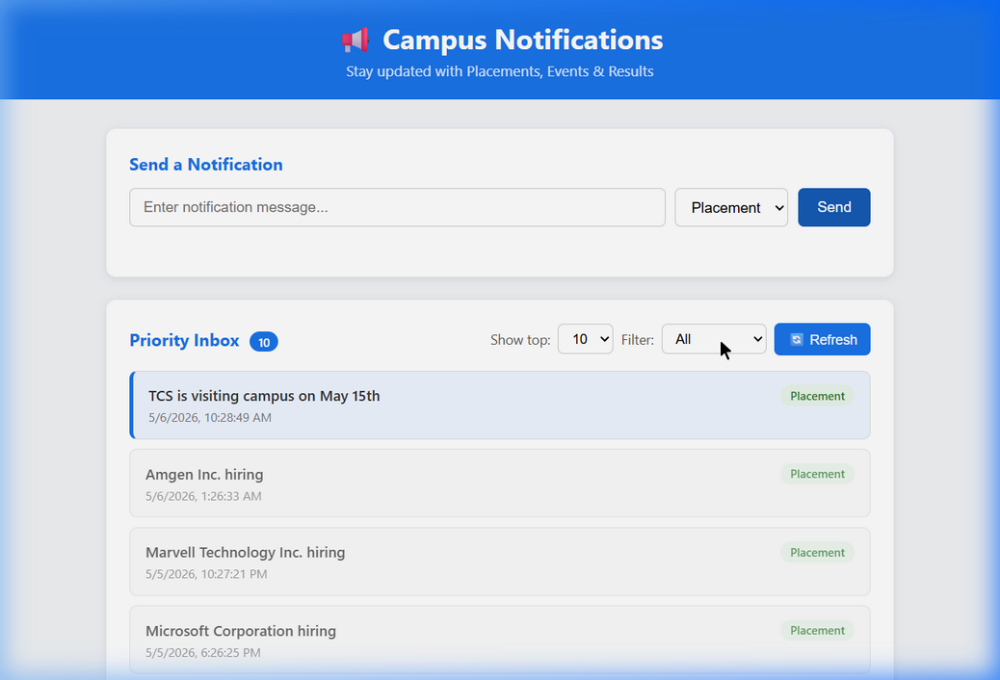
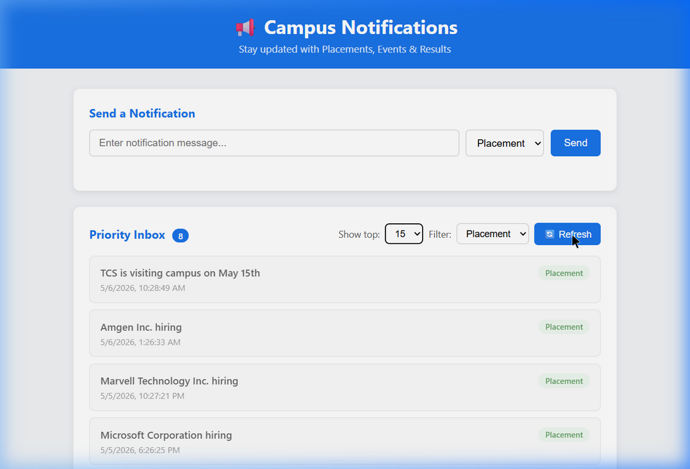

# Notification System Design

## Stage 1 – Priority Inbox

### Problem
Users lose track of important notifications because of the high volume. The app needs to always show the top 10 most important unread notifications first.

### Approach

**Priority Logic:**
Notifications are scored and ranked by two factors:
1. **Type weight** (higher = more important):
   - Placement → 3
   - Result → 2
   - Event → 1
2. **Recency** — for the same type, newer notifications appear first (timestamp descending)

**Top-N Display:**
After sorting, only the top N notifications are shown (default 10, user can choose 15 or 20).

**Filtering:**
Users can filter by type (Placement / Event / Result / All) before the top-N is applied.

**Seen/Unread Tracking:**
Notification IDs are stored in `localStorage` when the user first views them.
New (unread) notifications are highlighted with a blue left border. Previously seen ones appear dimmed.

**Handling new incoming notifications:**
When the user hits "Refresh", the app re-fetches from the API and merges with what was already seen. Any new notification ID not in `localStorage` is treated as unread and moves to the top of the visual list.

The priority sort ensures that even as new notifications stream in, the top 10 will always reflect the most impactful ones (Placement first, then Result, then Event), and within the same type, the most recent wins.

### Code File
- `notification_app_fe/app.js` → `sortByPriority()` and `renderNotifications()`

### Screenshots

**1. Initial Load — Priority Inbox with notifications from API**

**2. Sending a Placement notification**

**3. Filtered view — Placement only**

**4. Refreshed view — Top 15, Placement filter**

---

## Stage 2 – Frontend (React/Next)
*(To be implemented)*
